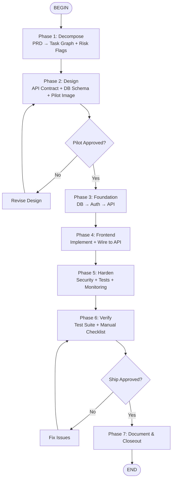

# Full-Stack Builder

This flow orchestrates complete feature development from a PRD (or feature description) to shipped code. It runs the agent through a structured build process with **explicit human gates** at critical decision points — design approval and ship approval.

The agent loads specialist skills at each phase and produces intermediate artifacts (task graph, API contract, pilot image) that anchor the implementation.

## Flow Overview



---

## Phase 1: Decompose

Read the PRD or feature request. Parse it into a **task dependency graph** before writing any code.

### Output: Task Graph

Produce a mental (or written) model with these sections:

**UI Surfaces**
- Pages, components, modals, or screens needed
- User flows (e.g., signup → onboarding → dashboard)
- Responsive breakpoints required

**Data Entities**
- Tables/collections and their relationships
- Fields, types, constraints
- Migration strategy (new table, alter column, etc.)

**API Operations**
- Endpoints: method, path, request shape, response shape
- Auth requirements per endpoint (public, user, admin)
- External integrations (payments, email, webhooks)

**Risk Flags**
- Unknowns requiring a spike (new library, unfamiliar API)
- Scope that may exceed one session
- Performance-sensitive operations (real-time, heavy compute)

### Scope Negotiation Gate

If the PRD contains more than can be delivered in one focused session, **ask the user**:

> "The PRD asks for X, Y, and Z. I can deliver X + Y in this session. Z requires [reason: new integration / heavy UI / complex algorithm]. Should I ship X + Y first, or do you want to scope down further?"

**Skills loaded:** `eng-coding-discipline` (read project spine), `eng-database-design` (schema thinking)

---

## Phase 2: Design

Run **two parallel tracks** where possible:

### Track A: API Contract + Database Schema (Agent executes)

1. **Database schema**: Define tables, columns, indexes, relationships. Write migrations.
2. **API contract**: Define endpoints with request/response shapes. Use the **eng-api-design** skill for conventions.
3. **Auth boundaries**: Map which endpoints need auth, which roles. Use **eng-auth-implementation**.

Output: A working schema and stubbed API routes (returning static data).

### Track B: UI Pilot Image (Agent executes, **human gates**)

1. Read the PRD's UI requirements and the project's design context
2. Use the workspace image generation script:
   ```bash
   python3 scripts/generate-image.py "<detailed visual description>" <project-path>/research/pilot.png
   ```
3. **STOP.** Show the generated image to the user. Wait for explicit approval before writing frontend code.

**Skills loaded:** `eng-api-design`, `eng-auth-implementation`, `eng-database-design`, `eng-front-end-design`

### Pilot Approval Gate

If the user rejects the pilot:
- Capture specific feedback (colors, layout, density, typography)
- Revise the visual description
- Regenerate and present again

Do not proceed to Phase 3 without approved design direction.

---

## Phase 3: Foundation

Build the backend in dependency order. Each layer validates before the next.

### Step 1: Database Layer

- Run migrations
- Seed with realistic test data
- Verify schema with a quick query

### Step 2: Auth Layer

- Implement login / register / logout
- Add auth middleware / route guards
- Test auth flow manually (can a protected route reject an unauthenticated request?)

Use **eng-auth-implementation** for JWT/session setup, password hashing, cookie security.

### Step 3: API Layer

- Implement endpoints with full business logic
- Add input validation, error handling, structured logging hooks
- Add `GET /health` endpoint for monitoring
- Test each endpoint with curl or a test script

Use **eng-api-design** for consistent response shapes and status codes.
Use **eng-monitoring** to add structured logging and error tracking hooks.

**Skills loaded:** `eng-database-design`, `eng-auth-implementation`, `eng-api-design`, `eng-monitoring`

---

## Phase 4: Frontend Implementation

Build the UI against the approved pilot and working API.

### Step 1: Scaffold & Static UI

- Build components and pages matching the approved pilot
- Use real data structures (from API contract) but static data initially
- Ensure responsive behavior

### Step 2: Wire to API

- Replace static data with API calls
- Handle loading, error, and empty states
- Add client-side caching or state management if needed

### Step 3: Polish

- Verify visual match to pilot image
- Check accessibility (focus states, keyboard nav, contrast)
- Optimize images and bundle size if needed

Use **eng-front-end-design** for aesthetics and typography.
Use **eng-state-management** for global state or server-state caching (TanStack Query, etc.).
Use **eng-caching** for API response caching and static asset optimization.

**Skills loaded:** `eng-front-end-design`, `eng-state-management`, `eng-caching`

---

## Phase 5: Harden

Run three parallel passes:

### Security Pass

- Input validation on all API endpoints
- SQL injection prevention (parameterized queries)
- XSS prevention (sanitize user-generated content)
- CSRF protection (`SameSite` cookies, CSRF tokens for forms)
- Secrets in environment variables only
- Authorization checks (users can't access other users' data)

Use **eng-secure-coding** for the full security checklist.

### Test Pass

- Unit tests for business logic and utilities
- Integration tests for API endpoints (happy path + error cases)
- Auth flow tests (login success, invalid credentials, expired token)
- UI component tests if the project has them

Use **eng-testing-debugging** for test strategy and TDD patterns.

### Observability Pass

- Add error tracking (Sentry) initialization
- Add structured logging to critical paths
- Verify `GET /health` responds correctly
- Add request timing logs

Use **eng-monitoring** for logging and alerting setup.

**Skills loaded:** `eng-secure-coding`, `eng-testing-debugging`, `eng-monitoring`

---

## Phase 6: Verify

### Automated Verification

Run the repo's proving commands:
```bash
# Examples — run whatever the repo uses
npm test
npm run lint
npm run typecheck
pytest
go test ./...
```

All must pass. If they fail, enter the fix loop: diagnose → fix → rerun.

### Manual Verification Checklist

Walk through the feature as a user would:

- [ ] Happy path works end-to-end
- [ ] Auth flows work (signup, login, logout, protected routes)
- [ ] Error states are handled gracefully (404, 422, 500)
- [ ] Empty states are handled (no data yet)
- [ ] Responsive on mobile/tablet/desktop
- [ ] Forms validate client-side and server-side
- [ ] Loading states are visible
- [ ] No console errors or unhandled exceptions

### Performance Sanity Check

- Page loads in < 3 seconds on a cold load
- API responses < 300ms for typical requests
- No obvious N+1 query patterns

Use **eng-performance** if any metric is off.

### Ship Approval Gate

**STOP.** Present a demo summary to the user:

> "Feature X is ready for review. Here's what was built: [summary]. Tests: [X/Y pass]. Manual verification: [checked items]. Risks: [any remaining]. Approve to ship, or flag issues to fix?"

If the user flags issues, enter the fix loop and return to verification.

**Skills loaded:** `eng-coding-discipline`, `eng-performance`

---

## Phase 7: Document & Closeout

### Documentation

- Update README if the feature changes setup or usage
- Add inline comments for non-obvious logic
- Document API changes if they affect consumers

Use **core-documentation** for documentation standards.
Use **eng-documentation** for API specs and changelogs.

### Closeout

State explicitly:
- **What changed** — summary of the work delivered
- **How it was tested** — commands run, checks performed
- **What risks remain** — untested paths, assumptions, follow-ups
- **What's deployed** — environment, URL, version

Use **eng-coding-discipline** for the closeout checklist.

---

## Error Recovery & Backtracking

| Situation | Recovery Path |
|-----------|---------------|
| Pilot rejected | Revise description, regenerate, re-present |
| Schema change mid-build | Update migrations, update API contract, update frontend types |
| API contract changes | Update frontend call sites, re-run integration tests |
| Tests fail after frontend wiring | Check mock data vs. real API response shape mismatch |
| Auth not working | Debug middleware order, token expiry, cookie settings |
| Scope too large | Return to Phase 1, negotiate scope reduction with user |
| External API unavailable | Stub/mock for now, flag as follow-up |

---

## Skill Reference Map

| Phase | Primary Skills |
|-------|---------------|
| Phase 1: Decompose | `eng-coding-discipline`, `eng-database-design` |
| Phase 2: Design | `eng-api-design`, `eng-auth-implementation`, `eng-database-design`, `eng-front-end-design` |
| Phase 3: Foundation | `eng-database-design`, `eng-auth-implementation`, `eng-api-design`, `eng-monitoring` |
| Phase 4: Frontend | `eng-front-end-design`, `eng-state-management`, `eng-caching` |
| Phase 5: Harden | `eng-secure-coding`, `eng-testing-debugging`, `eng-monitoring` |
| Phase 6: Verify | `eng-coding-discipline`, `eng-performance` |
| Phase 7: Document | `core-documentation`, `eng-documentation` |

---

## Anti-Patterns

| ❌ Don't | ✅ Do Instead |
|----------|---------------|
| Start coding before decomposing the PRD | Produce a task graph first |
| Skip the pilot image gate | Get explicit design approval before frontend work |
| Build frontend against unimplemented API | Stub API first, verify with curl |
| Ship without running the repo's tests | Run all proving commands |
| Skip auth because "it's just a prototype" | Implement auth early — retrofitting is expensive |
| Hide test failures | Report failures and fix them |
| Skip the closeout summary | Always state what changed, how it was tested, and what risks remain |
