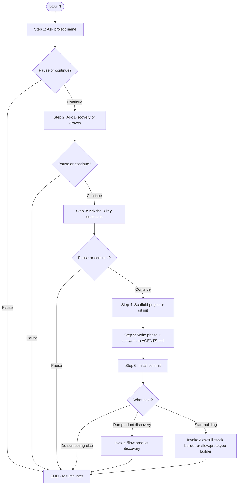

# New Project

This flow automates project scaffolding and setup. It collects all required information **before** creating the project directory, then scaffolds, initializes git, writes a complete `AGENTS.md`, and asks what to do next.

Each step is explicit and offers a pause option so you can step away without leaving work half-done.

## Flow Overview



---

## Step Instructions

### Step 1: Ask project name

Ask the user:
> "What should we name this project? Use lowercase letters, numbers, and hyphens only (e.g., habit-tracker, invoice-pro)."

Wait for their answer. If the name contains spaces or special characters, suggest a sanitized version.

After capturing the name, ask:
> "Project name set to '<name>'. Continue to phase selection, or pause here and resume later?"

### Step 2: Ask Discovery or Growth

Ask the user:
> "Are we in **discovery** mode (finding PMF, validating ideas, building MVP for 0–100K users) or **growth** mode (scaling, optimizing, expanding beyond 100K users)?"

Record the answer.

After capturing the phase, ask:
> "Phase set to <Discovery|Growth>. Continue to the 3 key questions, or pause here?"

### Step 3: Ask the 3 key questions

Ask sequentially:

> **1. What problems will be solved?**

> **2. Who experiences these problems?**

> **3. What are currently available solutions that are used?**

For each question, if the user's answer is vague or one sentence, ask a follow-up to get specifics.

After capturing all three, summarize back to the user and ask:
> "All required information collected. Ready to scaffold the project?"

### Step 4: Scaffold project + git init

Run these commands:

```bash
cd <workspace-root>
cp -r projects/templates/default projects/experiments/<project-name>
cd projects/experiments/<project-name>
git init
```

Replace `{{PROJECT_NAME}}` in `AGENTS.md` and `README.md` with the actual project name.

Create `src/` and `research/` directories if the template does not already include them.

### Step 5: Write phase + answers to AGENTS.md

Write the following into `projects/experiments/<project-name>/AGENTS.md`:

```markdown
## Project Phase
- **Current phase**: <Discovery | Growth>
- **Selected on**: <today's date>
- **Rationale**: <user's one-sentence reason>

## Project Key Questions
1. **What problems will be solved?**
   <answer>
2. **Who experiences these problems?**
   <answer>
3. **What are currently available solutions that are used?**
   <answer>
```

### Step 6: Initial commit

Then run:
```bash
git add AGENTS.md README.md .gitignore
git commit -m "init: scaffold project with phase and key questions"
```

### What next?

Present 3 options to the user:

> **Project "<name>" is scaffolded and ready.**
>
> What would you like to do next?
> 1. **Run product discovery** — `/flow:product-discovery` — structured discovery from idea to PRD
> 2. **Start building a prototype** — `/flow:prototype-builder` — step-by-step prototype with pause options
> 3. **Start full-stack building** — `/flow:full-stack-builder` — if you already have a PRD or clear scope
> 4. **Something else** — tell me what you need

Wait for the user's choice. If they pick a flow, execute it. If option 4, end the flow and let the user drive.

---

## Anti-Patterns

| ❌ Don't | ✅ Do Instead |
|----------|---------------|
| Scaffold before collecting phase and key questions | Collect all required info first, then scaffold |
| Commit before writing AGENTS.md | Write AGENTS.md first, then commit |
| Skip the key questions | Ask all 3 — they anchor all future work |
| Assume discovery phase without asking | Always ask the user |
| Use spaces in project names | Sanitize to kebab-case |
| Run `git commit -m "init"` without adding AGENTS.md | Stage AGENTS.md with the phase and questions |
