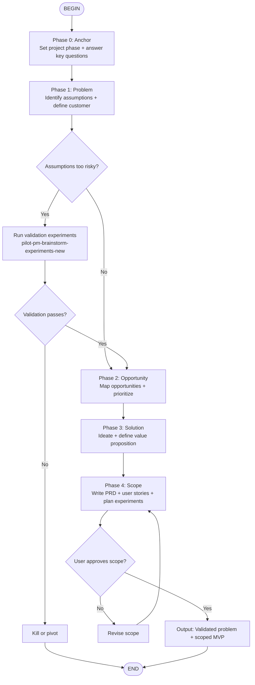

# Product Discovery Flow

This flow takes a raw idea or problem statement and walks it through structured product discovery — from "I have an idea" to "Here's what to build, for whom, and why." It loads `pilot-pm-*` skills at each phase and only asks the user for input at decision gates.

The discovery process is non-linear. The flow is designed to iterate: if validation fails at any gate, you loop back to an earlier step rather than forcing a bad idea forward.

## Flow Overview

---

## Phase 0: Anchor

Before any discovery work, ground the project.

**Agent actions:**
1. Read the project's `AGENTS.md`. If the **Project Phase** section is empty:
   - Ask the user: "Are we in discovery mode (finding PMF, 0–100K users) or growth mode (scaling beyond 100K users)?"
   - Record the answer in `AGENTS.md` under `## Project Phase`
2. If the **Project Key Questions** are empty, ask and record:
   - What problems will be solved?
   - Who experiences these problems?
   - What are currently available solutions that are used?
3. Summarize the problem statement in 2–3 sentences.

**Skills loaded:** `core-documentation`

**Output:** Project `AGENTS.md` updated with phase and key questions.

---

## Phase 1: Problem

Decompose the problem space and identify who it's for.

**Step 1.1 — Identify Risky Assumptions**

Use `pilot-pm-identify-assumptions-new` to stress-test the idea. Ask:
- What must be true for this product to work?
- Which assumptions, if wrong, kill the idea?
- Categorize risks: Value, Usability, Viability, Feasibility, Go-to-Market

Output: A ranked list of assumptions by risk.

**Step 1.2 — Define the Customer**

Use `pilot-pm-ideal-customer-profile` to identify who benefits most:
- Who has the burning pain?
- Who has budget / willingness to pay?
- Who can refer others?

Use `pilot-pm-market-segments` to identify 3–5 potential segments and evaluate each.

Use `pilot-pm-user-personas` to build 2–3 personas from the research data.

**Decision gate: Are assumptions too risky to proceed?**

If the top 2–3 assumptions are untested and could invalidate the entire idea, proceed to validation (Step 1.3). If assumptions are reasonable or already validated, skip to Phase 2.

**Step 1.3 — Validation Experiments (if needed)**

Use `pilot-pm-brainstorm-experiments-new` to design lean experiments:
- Landing page tests
- Explainer video tests
- Pre-order campaigns
- Wizard-of-Oz prototypes
- Concierge tests

Run the cheapest experiment that tests the riskiest assumption.

**Decision gate: Did validation pass?**

- **Yes** → Proceed to Phase 2
- **No** → Recommend killing or pivoting. Document learnings and end the flow.

**Skills loaded:** `pilot-pm-identify-assumptions-new`, `pilot-pm-ideal-customer-profile`, `pilot-pm-market-segments`, `pilot-pm-user-personas`, `pilot-pm-brainstorm-experiments-new`

**Output:** Validated (or invalidated) core assumptions + target customer profile.

---

## Phase 2: Opportunity

Map the problem landscape and decide where to focus.

**Step 2.1 — Opportunity Solution Tree**

Use `pilot-pm-opportunity-solution-tree` to structure discovery:
- Start with the desired outcome (e.g., "Users complete onboarding in under 5 minutes")
- Map opportunities (problems/pain points) that block that outcome
- For each opportunity, list potential solutions
- Prioritize opportunities by impact + confidence

**Step 2.2 — Prioritize Opportunities**

Use `pilot-pm-prioritize-assumptions` or `pilot-pm-prioritize-features` logic to rank opportunities.

Pick the **top 1–2 opportunities** to solve first. Everything else is backlog.

**Skills loaded:** `pilot-pm-opportunity-solution-tree`, `pilot-pm-prioritize-assumptions`

**Output:** An Opportunity Solution Tree with 1–2 prioritized opportunities.

---

## Phase 3: Solution

Generate and refine solutions for the prioritized opportunities.

**Step 3.1 — Ideate**

Use `pilot-pm-brainstorm-ideas-new` to generate feature ideas from PM, Designer, and Engineer perspectives.

Use `pilot-pm-job-stories` to express user situations and motivations:
> "When [situation], I want to [motivation], so I can [outcome]"

**Step 3.2 — Define Value Proposition**

Use `pilot-pm-value-proposition` to design the value prop using the JTBD template:
- Who is the customer?
- Why do they need this?
- What do they do today?
- How does your product help?
- What changes after they use it?
- What alternatives exist?

**Step 3.3 — Positioning**

Use `pilot-pm-positioning-ideas` to differentiate from competitors.

**Skills loaded:** `pilot-pm-brainstorm-ideas-new`, `pilot-pm-job-stories`, `pilot-pm-value-proposition`, `pilot-pm-positioning-ideas`

**Output:** 3–5 solution ideas with a clear value proposition and positioning statement.

---

## Phase 4: Scope

Package the discovery into a buildable MVP scope.

**Step 4.1 — Write the PRD**

Use `pilot-pm-create-prd` to write a Product Requirements Document:
- Problem statement
- Objectives and success metrics
- Target segments
- Value propositions
- Solution overview
- Release criteria

**Step 4.2 — Write User Stories**

Use `pilot-pm-user-stories` to break the PRD into backlog items with acceptance criteria.

Or use `pilot-pm-wwas` for structured backlog items in Why-What-Acceptance format.

**Step 4.3 — Plan Validation**

Use `pilot-pm-brainstorm-experiments-existing` to design experiments for the MVP:
- How will we know the MVP works?
- What metrics define success?
- What's the smallest experiment that proves value?

**Decision gate: User approves scope?**

Present the PRD + user stories + validation plan to the user. Ask:
> "This is the scoped MVP based on our discovery. Approve to proceed to implementation, or flag changes?"

- **Yes** → Discovery complete. Output the artifacts.
- **No** → Capture feedback, revise scope, and return to Step 4.1.

**Skills loaded:** `pilot-pm-create-prd`, `pilot-pm-user-stories`, `pilot-pm-wwas`, `pilot-pm-brainstorm-experiments-existing`

**Output:** PRD, user stories / backlog items, and validation experiment plan.

---

## Flow Completion

When the flow ends successfully, the project should have:

1. `AGENTS.md` updated with phase and key questions
2. A validated problem space (assumptions tested, customer defined)
3. An Opportunity Solution Tree with prioritized opportunities
4. A clear value proposition and positioning
5. A PRD scoped to MVP
6. User stories with acceptance criteria
7. A validation experiment plan

From here, invoke `full-stack-builder` to implement the scoped MVP.

---

## Error Recovery & Backtracking

| Situation | Recovery Path |
|-----------|---------------|
| Assumptions invalidate the idea | Kill or pivot; document learnings |
| Validation experiment fails | Loop back to Phase 1 to re-examine assumptions |
| No clear customer segment | Return to Phase 1.2 with broader or narrower criteria |
| Opportunity tree is too broad | Scope down to 1–2 opportunities; defer rest |
| User rejects PRD scope | Capture specific feedback, revise, re-present |
| Value proposition is weak | Return to Phase 3.2 with customer interview insights |

---

## Skill Reference Map

| Phase | Skills |
|-------|--------|
| Phase 0: Anchor | `core-documentation` |
| Phase 1: Problem | `pilot-pm-identify-assumptions-new`, `pilot-pm-ideal-customer-profile`, `pilot-pm-market-segments`, `pilot-pm-user-personas`, `pilot-pm-brainstorm-experiments-new` |
| Phase 2: Opportunity | `pilot-pm-opportunity-solution-tree`, `pilot-pm-prioritize-assumptions` |
| Phase 3: Solution | `pilot-pm-brainstorm-ideas-new`, `pilot-pm-job-stories`, `pilot-pm-value-proposition`, `pilot-pm-positioning-ideas` |
| Phase 4: Scope | `pilot-pm-create-prd`, `pilot-pm-user-stories`, `pilot-pm-wwas`, `pilot-pm-brainstorm-experiments-existing` |
