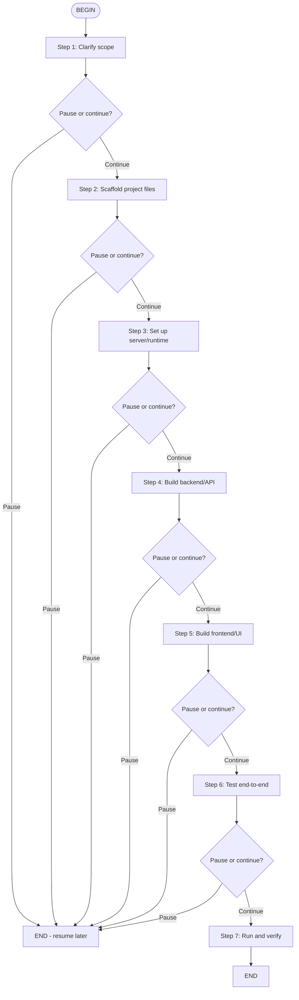

# Prototype Builder

Builds a lightweight, working prototype for discovery/validation. Unlike `full-stack-builder`, this flow prioritizes speed over production quality and offers **explicit pause points** after every major step so the user can step away without leaving work half-done.

## When to Use

- Validating an assumption with a working pretotype
- Building a landing page + simple tool for an experiment
- Creating a demo that will be thrown away or rewritten later
- Any build where the user may need to pause and resume

## Flow Overview



---

## Step 1: Clarify scope

Summarize what you understand the prototype needs to do. Confirm:

- What problem it tests
- The smallest feature set that proves value
- Tech stack preference (or propose one)
- Any API keys or external services needed

Ask the user:
> "I'll build a prototype that [summary]. Tech stack: [stack]. Any changes before I start?"

Then ask:
> "Scope confirmed. Continue to scaffolding, or pause here?"

## Step 2: Scaffold project files

Create the minimum file structure. For a web prototype this usually means:

```
src/
  package.json
  server.js (or app entry)
  public/
    index.html
    style.css
    app.js
  .env.example
```

After scaffolding, report what was created and ask:
> "Files scaffolded. Continue to server setup, or pause here?"

## Step 3: Set up server/runtime

Install dependencies and configure the runtime. For Node.js:

```bash
npm install
```

Create `.env.example` and explain what keys are needed.

After setup, report the installed dependencies and ask:
> "Server runtime ready. Continue to backend/API build, or pause here?"

## Step 4: Build backend/API

Implement the minimal backend:
- Routes/endpoints
- File handling or data processing
- External API calls (if any)
- In-memory storage where possible

After building, summarize the API surface and ask:
> "Backend built. Continue to frontend/UI build, or pause here?"

## Step 5: Build frontend/UI

Build the minimal frontend:
- HTML structure
- Basic styling
- Client-side logic
- Connection to backend

After building, summarize the UI and ask:
> "Frontend built. Continue to testing, or pause here?"

## Step 6: Test end-to-end

Run the prototype and verify:
- Server starts without errors
- Frontend loads
- Core user flow works
- Error cases are handled gracefully

Report test results. If tests fail, fix before asking to continue.

After testing, ask:
> "End-to-end tests pass. Continue to final run/verification, or pause here?"

## Step 7: Run and verify

Start the server and provide the local URL. Ask the user to try it.

If the user finds issues, iterate. Otherwise, summarize the prototype and next steps.

---

## Pause/Resume Behavior

At every pause point:
1. Summarize what was completed
2. List files touched
3. State the exact next step
4. Tell the user how to resume: "Say 'continue' or 'resume prototype' and I'll pick up from [next step]"

Do not leave background processes running indefinitely unless the user explicitly asks. Prefer stopping the server at pause points to save resources.

---

## Anti-Patterns

| ❌ Don't | ✅ Do Instead |
|----------|---------------|
| Build everything in one go without checking in | Pause and confirm at each step |
| Leave servers running when the user pauses | Stop the server, note how to restart |
| Skip testing because it's "just a prototype" | Test the core flow before declaring done |
| Use production-grade architecture | Keep it minimal and disposable |
| Commit secrets | Use `.env.example`, keep `.env` out of git |
